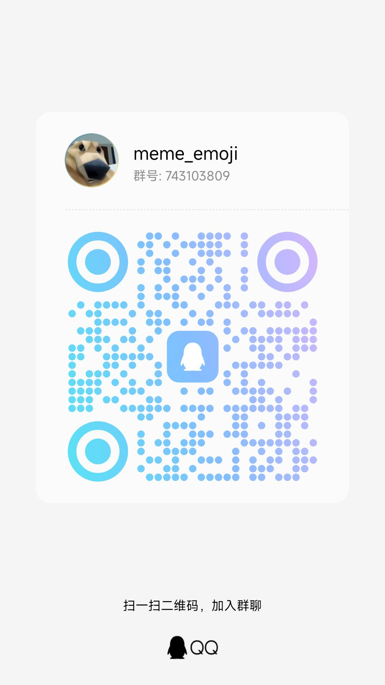

# meme_emoji 


<p align="center">
  
  
  <a href="https://pypi.org/project/meme-generator">
    
</p>

## 表情包扩展仓库 meme_emoji 

🚀 基于 [meme-generator](https://github.com/MemeCrafters/meme-generator) 插件做的扩展表情包仓库

*✨* 为你的聊天机器人添加更多趣味表情生成！


## 特性

- ✅ **海量表情** 偶尔做做热门表情包，也欢迎投稿高清有趣的素材
- ⚡ **实时生成** 支持通过指令快速生成表情
- 🔄 **搭配使用** 需要搭配 [meme-generator](https://github.com/MemeCrafters/meme-generator) 一起使用

- ✨**搭配演示架构图所示(仅供参考)：**


## 已实现表情示例

- 杯子系列 `[夏日琉璃子、琉璃子、圣修女、纪念版圣修女、限定版圣修女、对魔忍、偶像心跳、杰士邦、空气玩法]`
- 名人名言 `[大伟哥嘲笑指]`
- 芙芙指 `[芙宁娜嘲笑]`
- 表情三连 `[三连 内容]`


## 配置参考

### Windows Config:

> 文件参考路径 C:\Users\liew\AppData\Roaming\meme_generator\config.toml
>

```bash
[meme]
load_builtin_memes = true  # 是否加载内置表情包
meme_dirs = ["D:/meme_emoji/aircraft_cup","D:/meme_emoji/emoji"]  # 加载其他位置的表情包，填写
```

### Linux Config:

> 文件参考路径 /root/.config/meme_generator/config.toml
>

```bash
[meme]
load_builtin_memes = true  # 是否加载内置表情包
meme_dirs = ["/opt/meme_emoji/aircraft_cup","/opt/meme_emoji/emoji"]  # 加载其他位置的表情包，填写文件夹路径
```

## 相关链接

- [meme-generator](https://github.com/MemeCrafters/meme-generator) 的Wiki：[--> Wiki <--](https://github.com/MemeCrafters/meme-generator/wiki)

- [MemeCrafters/meme-generator-contrib](https://github.com/MemeCrafters/meme-generator-contrib) meme-generator 额外表情仓库

## 反馈
单个表情有问题反馈请附带日志和截图，答复受限网络没那么快及时处理

[issues]: https://github.com/anyliew/meme_emoji/issues

### meme_emoji 交流群 743103809 欢迎进来投稿高清素材




## 声明

本仓库的表情素材等均来自网络，如有侵权请联系作者删除

