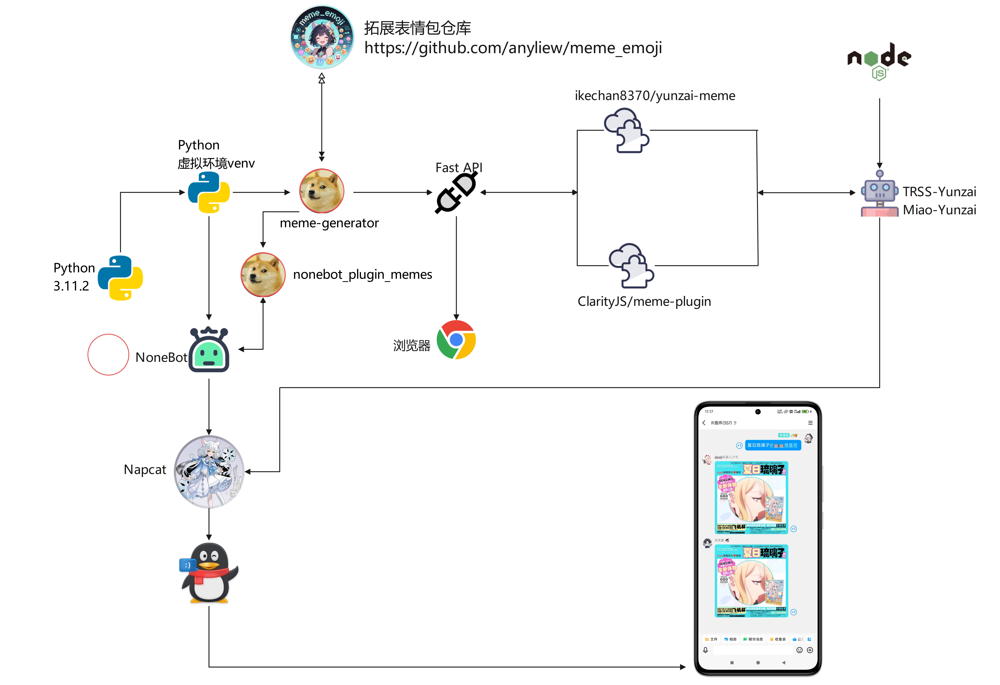
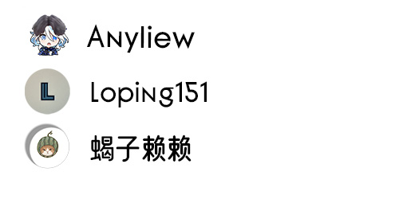

<div align="center">


# meme_emoji 

<p align="center">
  
  
  <a href="https://pypi.org/project/meme-generator">
    
  </a>
  <a href="https://qm.qq.com/q/DVb9aGPmaQ">
    
  </a>
</p>
</div>

## meme_emoji 表情包扩展仓库 

🚀 基于 [meme-generator](https://github.com/MemeCrafters/meme-generator) 做的表情包扩展仓库~

*✨* 为你的聊天机器人添加更多趣味表情生成！

> [!NOTE]
>
> 请注意，本仓库的内容仅支持以下特定版本的依赖库：
>
> - `meme_generator == 0.1.13`（最高兼容版本）
> - `nonebot-plugin-memes == 0.7.12`（最高兼容版本）
>
> 为确保功能正常运行，请勿使用高于指定版本的依赖库。
>
> 若您已安装更高版本，建议使用以下命令进行版本调整：
>
> ```
> pip install meme_generator==0.1.13
> ```
>
> Nonebot用户请使用：
> ```
> pip install nonebot-plugin-memes==0.7.12
> ```
> Nonebot的目录下pyproject.toml文件新增添加：
> ```
> plugins = ["nonebot_plugin_memes"]
> ```
> 

## 特性

- ✅ **海量表情** 偶尔做做热门表情包，也欢迎投稿高清有趣的素材
- ⚡ **实时生成** 支持通过指令快速生成表情
- 🔄 **搭配使用** 需要搭配 [meme-generator](https://github.com/MemeCrafters/meme-generator) 一起使用

- ✨**搭配演示架构图所示(仅供参考)：**




## 表情示例

### 简略清单

- 杯子系列 `[夏日琉璃子、琉璃子、圣修女、纪念版圣修女、限定版圣修女、对魔忍、偶像心跳、杰士邦、空气玩法]`

### 完整清单

表情详细信息、表情预览等可以在 [--> 表情列表 <--](https://github.com/anyliew/meme_emoji/blob/main/docs/meme_emoji_keywords.md) 查看

### 参考预览图：


### 目录文件信息

| Name                   | Attribute | Tags | Info                                                         |
| ---------------------- | --------- | ---- | ------------------------------------------------------------ |
| .github                | folder    | 忽略 | GitHub 平台相关的配置文件                                    |
| auto_powershell        | folder    | 忽略 | 开发者的优化批量脚本                                         |
| docker                 | folder    | 忽略 | Dcoker相关的编排部署配置文件                                 |
| docs                   | folder    | 必看 | 存放表情清单以及相关文档文件                                 |
| emoji                  | folder    | 必看 | 存放表情包素材和代码                                         |
| picture                | folder    | 忽略 | 仓库文档文件搭配的图片存放                                   |
| .gitignore             | file      | 忽略 | Git 版本控制系统中使用的配置文件，用于指定哪些文件或目录应该被 Git 忽略 |
| LICENSE                | file      | 忽略 | 最宽松，允许任意使用、修改、分发，只需保留原许可证和版权声明 |
| meme_emoji_keywords.py | file      | 忽略 | 处理表情包文档菜单的关键词映射或匹配Python脚本。             |
| README.md              | file      | 必看 | 仓库文档文件，通常用于说明项目的基本信息、使用方法、安装步骤等 |


## 使用教程

------
### Linux 系统使用教程
#### 下载

> [!TIP]
>
> 推荐下载在 linux系统的 /opt 目录下 亦可以自行调整


```
git clone https://github.com/anyliew/meme_emoji /opt/meme_emoji/
```
> [!TIP]
>
> 网络不好推荐这个
```
git clone https://ghfast.top/https://github.com/anyliew/meme_emoji /opt/meme_emoji/
```


#### 添加配置文件
> [!IMPORTANT]
> 文件名以及路径 : /root/.config/meme_generator/config.toml
>
> 我默认使用root账户的，非root用户请自行判断替换
>
>  [meme-generator](https://github.com/MemeCrafters/meme-generator) 第一次运行会生成这个文件，没有的话自行手动创建

config.toml 配置内容如下：

```
[meme]
load_builtin_memes = true  # 是否加载内置表情包
meme_dirs = ["/opt/meme_emoji/emoji"]  # 加载其他位置的表情包，填写文件夹路径
```
#### 更新 
> [!CAUTION]
> 通过Git 版本控制系统中一个常用的命令，用于从远程仓库获取最新代码并合并到本地
> 从而到达更新获取最新的 meme_emoji 表情包内容
```
cd /opt/meme_emoji/ && git pull
```

### Windows 系统使用教程

#### 下载

> [!TIP]
>
> 推荐下载在 Windows 系统的 C盘 目录下 亦可以自行调整


```
git clone https://github.com/anyliew/meme_emoji C:\meme_emoji
```
> [!TIP]
>
> 网络不好推荐这个
```
git clone https://ghfast.top/https://github.com/anyliew/meme_emoji C:\meme_emoji
```


#### 添加配置文件
> [!IMPORTANT]
> 文件名以及路径 : C:\Users\Administrator\AppData\Roaming\meme_generator\config.toml
>
> 我默认使用Administrator账户的，非Administrator用户请自行判断替换
>
>  [meme-generator](https://github.com/MemeCrafters/meme-generator) 第一次运行会生成这个文件，没有的话自行手动创建

config.toml 配置内容如下：

```
[meme]
load_builtin_memes = true  # 是否加载内置表情包
meme_dirs = ["C:/meme_emoji/emoji"]  # 加载其他位置的表情包，填写文件夹路径
```
#### 更新 
> [!CAUTION]
> 通过Git 版本控制系统中一个常用的命令，用于从远程仓库获取最新代码并合并到本地
> 从而到达更新获取最新的 meme_emoji 表情包内容
```
cd C:\meme_emoji\ && git pull
```
------


## 鸣谢

感谢以下开发者对 meme_emoji 仓库作出的贡献：

<a href="https://github.com/anyliew/meme_emoji/graphs/contributors">
  
</a>


## 反馈
### issues

单个表情有问题反馈请附带日志和截图
答复受限网络没那么快及时处理

> issues https://github.com/anyliew/meme_emoji/issues 

### 投稿
> 🚧QQ Group 743103809 
>
> 欢迎进来投稿高清素材，看到一些有趣的素材图片会制作成表情更新到本仓库！
>
> 亦可以通过issues中的模板 “投稿素材” 进行投稿，如果能Pr则更加完美，实在是泰裤辣~

## 相关链接

- [meme-generator](https://github.com/MemeCrafters/meme-generator) 的Wiki：[--> Wiki <--](https://github.com/MemeCrafters/meme-generator/wiki)

- [MemeCrafters/meme-generator-contrib](https://github.com/MemeCrafters/meme-generator-contrib) meme-generator 额外表情仓库

## 声明

本仓库的表情素材等均来自网络，如有侵权请联系作者删除
