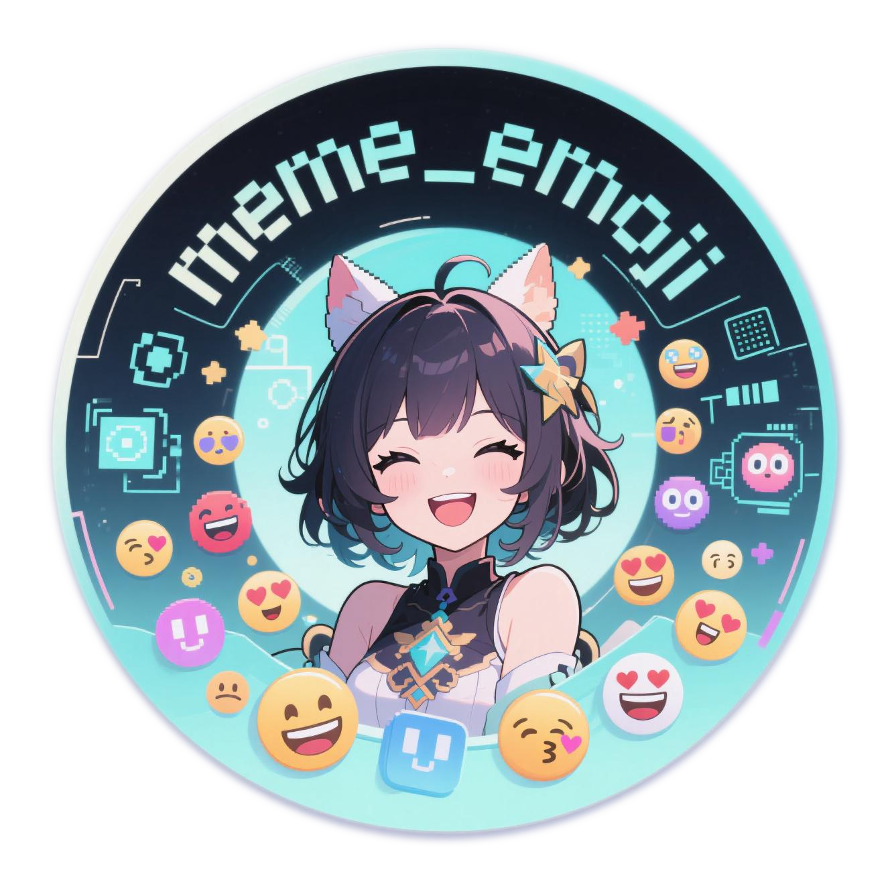
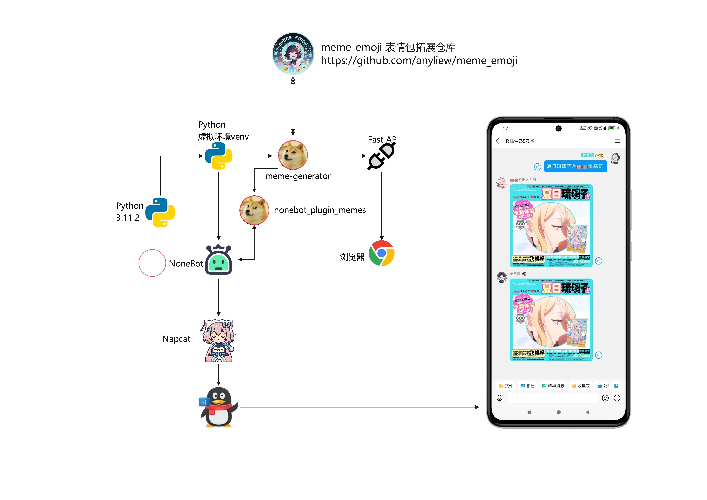
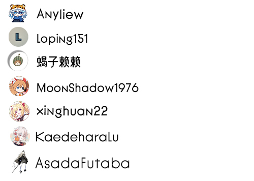

<div align="center">
<!-- ALL-CONTRIBUTORS-BADGE:START - Do not remove or modify this section -->
[](#contributors-)
<!-- ALL-CONTRIBUTORS-BADGE:END -->


# meme_emoji 

<p align="center">
  
  
  <a href="https://pypi.org/project/meme-generator">
    
  <a href="https://qm.qq.com/q/KZFZGdWmyG">
    
</p>
</div>

## meme_emoji 表情包扩展仓库 

*🚀* 基于 [meme-generator](https://github.com/MemeCrafters/meme-generator) 做的表情包扩展仓库~

*✨* 为你的聊天机器人添加更多趣味表情生成！

> [!TIP]
>
> 部分表情移至[crazy_emoji](https://github.com/anyliew/crazy_emoji) 

> [!NOTE]
>
> 请注意，本仓库的内容不支持Rust
>
> Rust的用户请移步[meme_emoji_rust](https://github.com/anyliew/meme_emoji_rust) 
>
> 仅支持以下特定版本的依赖库：
>
> - `meme_generator == 0.1.14`（最高兼容版本）
> - `nonebot-plugin-memes == 0.7.12`（最高兼容版本）
>
> 为确保功能正常运行，请勿使用高于指定版本的依赖库。
>
> 若您已安装更高版本，建议使用以下命令进行版本调整：
>
> ```
> pip install meme_generator==0.1.14
> ```
>
> Nonebot用户请使用：
> ```
> pip install nonebot-plugin-memes==0.7.12 && pip install meme_generator==0.1.14
> ```
> Nonebot的目录下pyproject.toml文件新增添加：
> ```
> plugins = ["nonebot_plugin_memes"]
> ```

## ✨特性

- ✅ **海量表情** 偶尔做做热门表情包，也欢迎投稿高清有趣的素材
- ⚡ **实时生成** 支持通过指令快速生成表情
- 🔄 **搭配使用** 需要搭配 [meme-generator](https://github.com/MemeCrafters/meme-generator) 一起使用

- ✨**搭配演示架构图所示(仅供参考)：**



## 🤠 表情示例

### 🖼 参考预览图：
<details><summary>🖼点击展开 预览图 "狗耳帽"</summary><p>
<a></a>
</details>

### 😀 表情列表清单

#### 😉 名称排序  A-Z

* [表情列表](https://github.com/anyliew/meme_emoji/wiki/%E8%A1%A8%E6%83%85%E5%88%97%E8%A1%A8)

#### 🥰 时间排序  新-旧

* [表情列表](https://github.com/anyliew/meme_emoji/wiki/emoji_list)


## 📄 使用教程 

- [meme_emoji wiki](https://github.com/anyliew/meme_emoji/wiki) 

## 📝 反馈

### 🤔 issues

> issues https://github.com/anyliew/meme_emoji/issues 

单个表情有问题反馈请附带日志和截图
答复受限网络没那么快及时处理

### 🐧QQ Group

* [进群注意事项](https://github.com/anyliew/meme_emoji/wiki/qq_group)

<a href="https://qm.qq.com/q/KZFZGdWmyG">
  
</a>


## 🥳 投稿

> 🚧欢迎投稿高清素材，看到一些有趣的素材图片会制作成表情更新到本仓库！
>
> 通过issues中的模板 “投稿素材” 进行投稿，如果能Pr则更加完美，实在是泰裤辣~
> 


## ⚖ 许可

延续(copy) meme-generator 作者  MeetWq MIT 许可证 

> MIT License https://github.com/MemeCrafters/meme-generator/blob/main/LICENSE
> 
> MIT License https://github.com/anyliew/meme_emoji/blob/main/LICENSE
> 
>chat.deepseek https://github.com/anyliew/meme_emoji/raw/main/docs/picture/chat.deepseek.png)


## 🔗 相关链接

### meme-generator
- [meme-generator](https://github.com/MemeCrafters/meme-generator) 

### WIKI 文档
- [meme-generator wiki](https://github.com/MemeCrafters/meme-generator/wiki)
- [meme_emoji wiki](https://github.com/anyliew/meme_emoji/wiki)


## 💐 鸣谢

感谢以下开发者对 meme_emoji 仓库作出的贡献

<a href="https://github.com/anyliew/meme_emoji/graphs/contributors">
  
</a>


## ⭐ 支持本项目

如果你觉得本项目对你有帮助，请给本项目点一个star，你的鼓励是我们不断前进的动力。


## 💬 免责声明

- 本项目仅供学习和交流使用，禁止用于任何商业用途及违法用途。

- 项目中的图片等资源均来自互联网，如有侵权请及时联系开发者，我们会尽快处理删除相关内容。


## Contributors ✨

Thanks goes to these wonderful people ([emoji key](https://allcontributors.org/docs/en/emoji-key)):

<!-- ALL-CONTRIBUTORS-LIST:START - Do not remove or modify this section -->
<!-- prettier-ignore-start -->
<!-- markdownlint-disable -->
<table>
  <tbody>
    <tr>
      <td align="center" valign="top" width="14.28%"><a href="https://wangkailing151.com/"><br /><sub><b>Loping151</b></sub></a><br /><a href="https://github.com/anyliew/anyliew/meme_emoji/commits?author=Loping151" title="Code">💻</a></td>
      <td align="center" valign="top" width="14.28%"><a href="https://github.com/LRZ9712"><br /><sub><b>tudou</b></sub></a><br /><a href="https://github.com/anyliew/anyliew/meme_emoji/commits?author=LRZ9712" title="Code">💻</a></td>
    </tr>
  </tbody>
  <tfoot>
    <tr>
      <td align="center" size="13px" colspan="7">
        
          <a href="https://all-contributors.js.org/docs/en/bot/usage">Add your contributions</a>
        </img>
      </td>
    </tr>
  </tfoot>
</table>

<!-- markdownlint-restore -->
<!-- prettier-ignore-end -->

<!-- ALL-CONTRIBUTORS-LIST:END -->

This project follows the [all-contributors](https://github.com/all-contributors/all-contributors) specification. Contributions of any kind welcome!