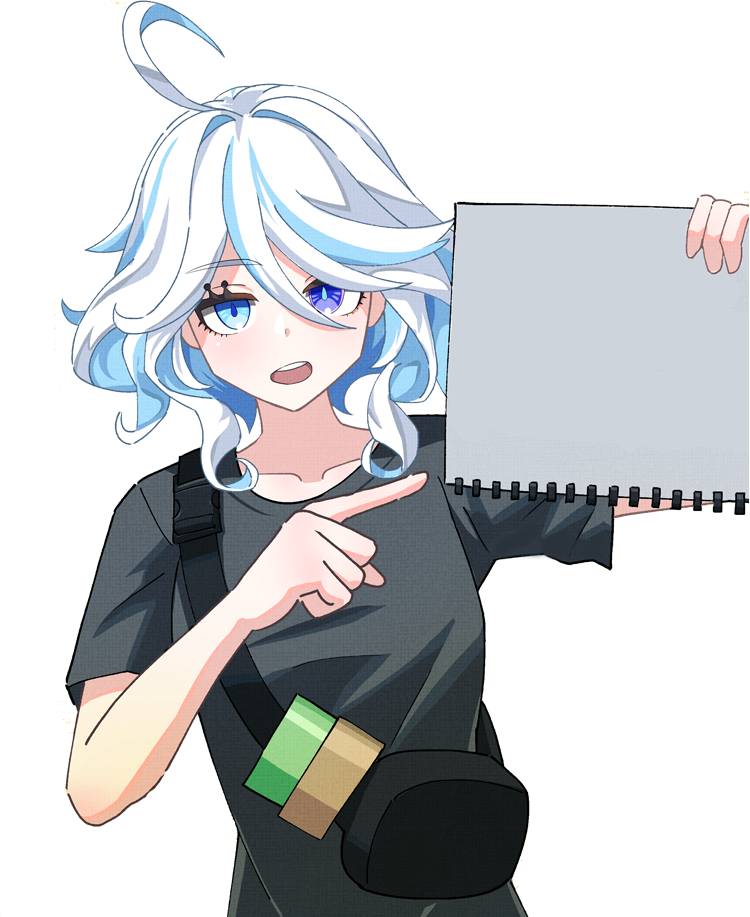
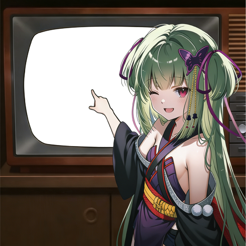
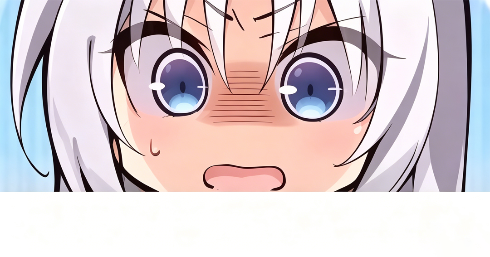

# ✨meme_emoji 表情列表清单

**🎈总表情数：139**

| # | 预览 | 关键词 | 图片数 | 文字数 | 默认文字 | 模块 | 创建日期 |
|---|------|--------|-----------|--------|--------|------------|------|
| 1 |  | 手写 | &nbsp; | 1 | 你好，世界！ | [handwriting](../emoji/handwriting) | 2025-06-11 |
| 2 |  | 宝宝、 BB、 bb、 baby、 Baby | 1 | 0 | &nbsp; | [baby](../emoji/baby) | 2025-06-11 |
| 3 |  | 难道说、 松伦说 | &nbsp; | 1 | 鸣潮玩家的声音太尖锐了 | [kurogames_songlun_say](../emoji/kurogames_songlun_say) | 2025-06-10 |
| 4 |  | 秧秧老公 | 1 | 0 | &nbsp; | [kurogames_yangyang_lover](../emoji/kurogames_yangyang_lover) | 2025-06-10 |
| 5 |  | 准考证 | 1 | 0 | &nbsp; | [yuzu_soft_ticket](../emoji/yuzu_soft_ticket) | 2025-06-07 |
| 6 |  | 守岸人举牌 | &nbsp; | 1 | 松伦狗策划太坏了 | [kurogames_the_shorekeeper_holdsign](../emoji/kurogames_the_shorekeeper_holdsign) | 2025-06-05 |
| 7 |  | 嵴锋龙相框 | 1 | 0 | &nbsp; | [mihoyo_tepetlisauri_frame](../emoji/mihoyo_tepetlisauri_frame) | 2025-06-01 |
| 8 |  | 双子相框 | 1 | 0 | &nbsp; | [mihoyo_gemini_frame](../emoji/mihoyo_gemini_frame) | 2025-06-01 |
| 9 |  | 芭芭拉相框 | 1 | 0 | &nbsp; | [mihoyo_barbara_pegg_frame](../emoji/mihoyo_barbara_pegg_frame) | 2025-06-01 |
| 10 |  | 雷史莱姆相框、 雷电史莱姆相框 | 1 | 0 | &nbsp; | [mihoyo_thunderbolt_slime_frame](../emoji/mihoyo_thunderbolt_slime_frame) | 2025-06-01 |
| 11 |  | 卡利贝尔相框 | 1 | 0 | &nbsp; | [mihoyo_caribert_alberich_frame](../emoji/mihoyo_caribert_alberich_frame) | 2025-06-01 |
| 12 |  | 恰斯卡相框 | 1 | 0 | &nbsp; | [mihoyo_chasca_frame](../emoji/mihoyo_chasca_frame) | 2025-06-01 |
| 13 |  | 达达利亚相框、 阿贾克斯相框、 公子相框 | 1 | 0 | &nbsp; | [mihoyo_tartaglia_frame](../emoji/mihoyo_tartaglia_frame) | 2025-06-01 |
| 14 |  | 可莉相框 | 1 | 0 | &nbsp; | [mihoyo_klee_frame](../emoji/mihoyo_klee_frame) | 2025-06-01 |
| 15 |  | 锅巴相框 | 1 | 0 | &nbsp; | [mihoyo_guoba_frame](../emoji/mihoyo_guoba_frame) | 2025-06-01 |
| 16 |  | 烟绯相框 | 1 | 0 | &nbsp; | [mihoyo_yanfei_frame](../emoji/mihoyo_yanfei_frame) | 2025-06-01 |
| 17 |  | 胡桃相框 | 1 | 0 | &nbsp; | [mihoyo_hutao_frame](../emoji/mihoyo_hutao_frame) | 2025-06-01 |
| 18 |  | 风史莱姆相框 | 1 | 0 | &nbsp; | [mihoyo_wind_slime_frame](../emoji/mihoyo_wind_slime_frame) | 2025-06-01 |
| 19 |  | 鹿野院平藏相框 | 1 | 0 | &nbsp; | [mihoyo_shikanoin_heizou_frame](../emoji/mihoyo_shikanoin_heizou_frame) | 2025-06-01 |
| 20 |  | 芙宁娜举牌、 芙芙举牌、 芙芙酱举牌 | &nbsp; | 1 | 大伟丘，你的声音太尖锐了 | [mihoyo_funina_holdsign](../emoji/mihoyo_funina_holdsign) | 2025-06-01 |
| 21 |  | 卡维相框 | 1 | 0 | &nbsp; | [mihoyo_kaveh_frame](../emoji/mihoyo_kaveh_frame) | 2025-06-01 |
| 22 |  | 编辑协会相框 | 1 | 0 | &nbsp; | [mihoyo_editorial_society_frame](../emoji/mihoyo_editorial_society_frame) | 2025-06-01 |
| 23 |  | 安柏相框 | 1 | 0 | &nbsp; | [mihoyo_amber_frame](../emoji/mihoyo_amber_frame) | 2025-06-01 |
| 24 |  | 旅行者相框 | 1 | 0 | &nbsp; | [mihoyo_traveler_frame](../emoji/mihoyo_traveler_frame) | 2025-06-01 |
| 25 |  | 九条裟罗相框 | 1 | 0 | &nbsp; | [mihoyo_kujou_sara_frame](../emoji/mihoyo_kujou_sara_frame) | 2025-06-01 |
| 26 |  | 派蒙王冠、 派蒙皇冠、 👑 | 1 | 0 | &nbsp; | [mihoyo_paimon_crown](../emoji/mihoyo_paimon_crown) | 2025-06-01 |
| 27 |  | 久岐忍相框、 阿忍相框 | 1 | 0 | &nbsp; | [mihoyo_kuki_shinobu_frame](../emoji/mihoyo_kuki_shinobu_frame) | 2025-06-01 |
| 28 |  | 异乡人相框 | 1 | 0 | &nbsp; | [mihoyo_outlander_frame](../emoji/mihoyo_outlander_frame) | 2025-06-01 |
| 29 |  | 可莉帽子相框 | 1 | 0 | &nbsp; | [mihoyo_klee_hat_frame](../emoji/mihoyo_klee_hat_frame) | 2025-06-01 |
| 30 |  | 派蒙相框 | 1 | 0 | &nbsp; | [mihoyo_paimon_frame](../emoji/mihoyo_paimon_frame) | 2025-06-01 |
| 31 |  | 可莉嘟嘟可相框、 嘟嘟可 | 1 | 0 | &nbsp; | [mihoyo_klee_duduke_frame](../emoji/mihoyo_klee_duduke_frame) | 2025-06-01 |
| 32 |  | 丘丘人相框 | 1 | 0 | &nbsp; | [mihoyo_hilichurl_frame](../emoji/mihoyo_hilichurl_frame) | 2025-06-01 |
| 33 |  | 茜特菈莉相框、 奶奶相框 | 1 | 0 | &nbsp; | [mihoyo_citlali_frame](../emoji/mihoyo_citlali_frame) | 2025-06-01 |
| 34 |  | 萌新礼包 | 1 | 0 | &nbsp; | [fleshlight_mengxin_packs](../emoji/fleshlight_mengxin_packs) | 2025-06-01 |
| 35 |  | 巴巴托斯、 风神相框 | 1 | 0 | &nbsp; | [mihoyo_barbatos_frame](../emoji/mihoyo_barbatos_frame) | 2025-06-01 |
| 36 |  | 应急食品相框 | 1 | 0 | &nbsp; | [mihoyo_paimon_emergency_food_frame](../emoji/mihoyo_paimon_emergency_food_frame) | 2025-06-01 |
| 37 |  | 咕咕河豚小课堂、 小课堂 | &nbsp; | 1 | 松伦哥,不要再涩涩了 | [kurogames_gugu_blowfish_small_classes](../emoji/kurogames_gugu_blowfish_small_classes) | 2025-06-01 |
| 38 |  | 冰史莱姆相框 | 1 | 0 | &nbsp; | [mihoyo_lce_slime_frame](../emoji/mihoyo_lce_slime_frame) | 2025-06-01 |
| 39 |  | 坤坤想要、 蔡徐坤想要、 爱坤想要 | 1 | 0 | &nbsp; | [ikun_need_tv](../emoji/ikun_need_tv) | 2025-05-30 |
| 40 |  | 杏奈 | 1 | 0 | &nbsp; | [fleshlight_xingnai](../emoji/fleshlight_xingnai) | 2025-05-30 |
| 41 |  | 新手礼包 | 1 | 0 | &nbsp; | [fleshlight_starter_pack](../emoji/fleshlight_starter_pack) | 2025-05-30 |
| 42 |  | 丰川祥子、 祥子、 豊川祥子 | 1 | 0 | &nbsp; | [mygo_sakiko_togawa](../emoji/mygo_sakiko_togawa) | 2025-05-30 |
| 43 |  | 桥本友希 | 1 | 0 | &nbsp; | [fleshlight_qiaobenyouxi](../emoji/fleshlight_qiaobenyouxi) | 2025-05-30 |
| 44 |  | 榴莲 | 1 | 0 | &nbsp; | [durian](../emoji/durian) | 2025-05-29 |
| 45 |  | 🍊、 橘、 橘子 | 1 | 0 | &nbsp; | [orange](../emoji/orange) | 2025-05-29 |
| 46 |  | kfc、 KFC、 肯德基 | 1 | 0 | &nbsp; | [kfc](../emoji/kfc) | 2025-05-29 |
| 47 |  | 篮球、 🏀 | 1 | &nbsp; | &nbsp; | [ikun_basketball](../emoji/ikun_basketball) | 2025-05-29 |
| 48 |  | 京东外卖 | 1 | &nbsp; | &nbsp; | [jd_takeout](../emoji/jd_takeout) | 2025-05-29 |
| 49 |  | 星期四、 疯狂星期四 | 1 | &nbsp; | &nbsp; | [kfc_thursday](../emoji/kfc_thursday) | 2025-05-29 |
| 50 |  | 甩 | 1 | &nbsp; | &nbsp; | [shuai](../emoji/shuai) | 2025-05-27 |
| 51 |  | 火柴撸 | 1 | &nbsp; | &nbsp; | [huochailu](../emoji/huochailu) | 2025-05-27 |
| 52 |  | 导 | 1 | &nbsp; | &nbsp; | [daoguan](../emoji/daoguan) | 2025-05-27 |
| 53 |  | 捶你 | 1 | &nbsp; | &nbsp; | [chuini](../emoji/chuini) | 2025-05-27 |
| 54 |  | 怼地、 怼 | 1 | &nbsp; | &nbsp; | [duidi](../emoji/duidi) | 2025-05-27 |
| 55 |  | 川妈妈 | 1 | &nbsp; | &nbsp; | [chuanmama](../emoji/chuanmama) | 2025-05-27 |
| 56 |  | 口 | 2 | &nbsp; | &nbsp; | [kou](../emoji/kou) | 2025-05-27 |
| 57 |  | 挣扎 | 1 | 0 | &nbsp; | [anyliew_struggling](../emoji/anyliew_struggling) | 2025-05-26 |
| 58 |  | 挚爱 | 1 | 0 | &nbsp; | [anyliew_people_I_like](../emoji/anyliew_people_I_like) | 2025-05-26 |
| 59 |  | 琳妮特举牌 | &nbsp; | 1 | 林尼大笨蛋 | [mihoyo_lynette_holdsign](../emoji/mihoyo_lynette_holdsign) | 2025-05-26 |
| 60 |  | 莫特斐举牌 | &nbsp; | 1 | 今汐令尹万岁！ | [kurogames_mortefi_holdsign](../emoji/kurogames_mortefi_holdsign) | 2025-05-26 |
| 61 |  | 爱莉希雅降临 | 2 | &nbsp; | &nbsp; | [mihoyo_elysia_come](../emoji/mihoyo_elysia_come) | 2025-05-25 |
| 62 |  | 凌阳举牌、 雪豹举牌 | &nbsp; | 1 | 你必定歪我 | [kurogames_lingyang_holdsign](../emoji/kurogames_lingyang_holdsign) | 2025-05-25 |
| 63 |  | 在一起 | 2 | &nbsp; | &nbsp; | [together_two](../emoji/together_two) | 2025-05-25 |
| 64 |  | 丛雨讨厌 | 1 | 0 | &nbsp; | [yuzu_soft_murasame_dislike](../emoji/yuzu_soft_murasame_dislike) | 2025-05-25 |
| 65 |  | 丛雨喜欢 | 1 | 0 | &nbsp; | [yuzu_soft_murasame_like](../emoji/yuzu_soft_murasame_like) | 2025-05-25 |
| 66 |  | 泳衣合影 | 2 | &nbsp; | &nbsp; | [swimsuit_group_photo](../emoji/swimsuit_group_photo) | 2025-05-25 |
| 67 |  | 漂泊者头像框 | 1 | 0 | &nbsp; | [kurogames_rover_head](../emoji/kurogames_rover_head) | 2025-05-25 |
| 68 |  | 鹿乃子乃子、 鹿乃子 | 1 | 0 | &nbsp; | [shikanoko_noko](../emoji/shikanoko_noko) | 2025-05-25 |
| 69 |  | 🐶、 狗 | 1 | &nbsp; | &nbsp; | [dog_face](../emoji/dog_face) | 2025-05-25 |
| 70 |  | 亚托莉喜欢 | 1 | 0 | &nbsp; | [atri_like](../emoji/atri_like) | 2025-05-25 |
| 71 |  | 芙芙指、 芙宁娜指、 芙芙酱指 | 1 | 0 | &nbsp; | [mihoyo_funina_finger](../emoji/mihoyo_funina_finger) | 2025-05-25 |
| 72 |  | 帮鹿、 帮🦌 | 2 | &nbsp; | &nbsp; | [deer_help](../emoji/deer_help) | 2025-05-25 |
| 73 |  | 折磨自己 | 2 | &nbsp; | &nbsp; | [torture_yourself](../emoji/torture_yourself) | 2025-05-25 |
| 74 |  | 坤坤喜欢 | 1 | 0 | &nbsp; | [ikun_like](../emoji/ikun_like) | 2025-05-25 |
| 75 |  | 菲比评分表、 评分表 | 1 | 0 | &nbsp; | [kurogames_phoebe_ score_sheet](../emoji/kurogames_phoebe_ score_sheet) | 2025-05-24 |
| 76 |  | 卡提举牌、 卡提希娅举牌、 卡提西亚举牌 | &nbsp; | 1 | 一份青枝月桂沙拉谢谢 | [kurogames_cartethyia_holdsign](../emoji/kurogames_cartethyia_holdsign) | 2025-05-17 |
| 77 |  | 珂莱塔举牌 | &nbsp; | 1 | 十连三金 | [kurogames_carlotta_holdsign](../emoji/kurogames_carlotta_holdsign) | 2025-05-17 |
| 78 |  | 李松伦举牌、 松伦举牌、 松伦哥举牌 | &nbsp; | 1 | 你必歪雪豹 | [kurogames_songlun_holdsign](../emoji/kurogames_songlun_holdsign) | 2025-05-17 |
| 79 |  | 漂泊者举牌 | &nbsp; | 1 | 不可以色色 | [kurogames_rover_holdsign](../emoji/kurogames_rover_holdsign) | 2025-05-17 |
| 80 |  | 小维举牌、 维里奈举牌 | &nbsp; | 1 | 不可以色色 | [kurogames_verina_holdsign](../emoji/kurogames_verina_holdsign) | 2025-05-17 |
| 81 |  | 刘伟举牌、 大伟举牌、 大伟哥举牌 | &nbsp; | 1 | 你的声音太尖锐了 | [mihoyo_liuwei_holdsign](../emoji/mihoyo_liuwei_holdsign) | 2025-05-17 |
| 82 |  | 常陸茉子举牌、 茉子举牌、 常陆茉子举牌 | &nbsp; | 1 | Ciallo～ | [yuzu_soft_mako_hitachi_holdsign](../emoji/yuzu_soft_mako_hitachi_holdsign) | 2025-05-17 |
| 83 |  | 折枝举牌 | &nbsp; | 1 | 祝你鸣潮玩的开心 | [kurogames_zhezhi_holdsign](../emoji/kurogames_zhezhi_holdsign) | 2025-05-17 |
| 84 |  | 芙芙卡片、 芙宁娜卡片、 芙芙酱卡片 | &nbsp; | 1 | 曾经我是戴上假面的演员，只想要掩饰真相… | [mihoyo_funina_card](../emoji/mihoyo_funina_card) | 2025-05-17 |
| 85 |  | 菲比说 | &nbsp; | 1 | 嘟嘟嘟说什么呢 | [kurogames_phoebe_say](../emoji/kurogames_phoebe_say) | 2025-05-10 |
| 86 |  | 长离指 | 1 | 0 | &nbsp; | [kurogames_changli_finger](../emoji/kurogames_changli_finger) | 2025-05-10 |
| 87 |  | 芙芙方形头像、 芙宁娜方形头像 | 1 | 0 | &nbsp; | [mihoyo_funina_square_head](../emoji/mihoyo_funina_square_head) | 2025-03-29 |
| 88 |  | 榴莲坤头 | 1 | 0 | &nbsp; | [ikun_durian_head](../emoji/ikun_durian_head) | 2025-03-29 |
| 89 |  | 芙芙圆形头像、 芙宁娜圆形头像 | 1 | 0 | &nbsp; | [mihoyo_funina_round_head](../emoji/mihoyo_funina_round_head) | 2025-03-29 |
| 90 |  | 小黑子 | 1 | 0 | &nbsp; | [ikun_head](../emoji/ikun_head) | 2025-03-25 |
| 91 |  | 冰红茶 | 1 | 0 | &nbsp; | [ice_tea_head](../emoji/ice_tea_head) | 2025-03-25 |
| 92 |  | 收养 | 1 | 0 | &nbsp; | [adoption](../emoji/adoption) | 2025-03-24 |
| 93 |  | 宁宁困惑、 绫地宁宁困惑 | 1 | 0 | &nbsp; | [yuzu_soft_ayachi_nene](../emoji/yuzu_soft_ayachi_nene) | 2025-03-24 |
| 94 |  | 神宫美优子 | 1 | 0 | &nbsp; | [fleshlight_miyuko_kamimiya](../emoji/fleshlight_miyuko_kamimiya) | 2025-03-24 |
| 95 |  | 紫域精灵 | 1 | 0 | &nbsp; | [fleshlight_purple_spirit](../emoji/fleshlight_purple_spirit) | 2025-03-24 |
| 96 |  | 亚托莉指 | 1 | 0 | &nbsp; | [atri_finger](../emoji/atri_finger) | 2025-03-24 |
| 97 |  | 天使心 | 1 | 0 | &nbsp; | [fleshlight_angel](../emoji/fleshlight_angel) | 2025-03-24 |
| 98 |  | 丛雨衣服、 丛雨衣物 | 1 | 0 | &nbsp; | [yuzu_soft_murasame_clothes](../emoji/yuzu_soft_murasame_clothes) | 2025-03-24 |
| 99 |  | 空气玩法 | 1 | 0 | &nbsp; | [fleshlight_air_play](../emoji/fleshlight_air_play) | 2025-03-24 |
| 100 |  | ⭐️💢契约、 橙喵契约、 卖身契 | 1 | 0 | &nbsp; | [contract](../emoji/contract) | 2025-03-24 |
| 101 |  | 京东外卖骑手、 京东外卖工牌 | 1 | 0 | &nbsp; | [jd_delivery_person](../emoji/jd_delivery_person) | 2025-03-24 |
| 102 |  | 一生一世 | 2 | &nbsp; | &nbsp; | [all_the_days](../emoji/all_the_days) | 2025-03-14 |
| 103 |  | 死刑 | 1 | 0 | &nbsp; | [mihoyo_funina_death_penalty](../emoji/mihoyo_funina_death_penalty) | 2025-03-14 |
| 104 |  | 原批、 原神玩家 | 1 | 0 | &nbsp; | [mihoyo_genshin_impact_players](../emoji/mihoyo_genshin_impact_players) | 2025-03-14 |
| 105 |  | 拉拉队偶像 | 1 | 0 | &nbsp; | [fleshlight_hoshino_alice](../emoji/fleshlight_hoshino_alice) | 2025-03-13 |
| 106 |  | 清洗液 | 1 | 0 | &nbsp; | [fleshlight_cleaning_liquid](../emoji/fleshlight_cleaning_liquid) | 2025-03-13 |
| 107 |  | 纯洁臀 | 1 | 0 | &nbsp; | [fleshlight_pure_buttocks](../emoji/fleshlight_pure_buttocks) | 2025-03-13 |
| 108 |  | 魔女之森 | 1 | 0 | &nbsp; | [fleshlight_selena](../emoji/fleshlight_selena) | 2025-03-13 |
| 109 |  | 求我 | 1 | &nbsp; | &nbsp; | [begged_me](../emoji/begged_me) | 2025-03-10 |
| 110 |  | 松伦哥指、 潮批 | 1 | 0 | &nbsp; | [kurogames_songlun](../emoji/kurogames_songlun) | 2025-03-07 |
| 111 |  | 鸣批、 鸣P、 鸣p、 鸣潮玩家、 鸣潮男 | 1 | 0 | &nbsp; | [kurogames_mp](../emoji/kurogames_mp) | 2025-03-07 |
| 112 |  | 烟花头像 | 1 | 0 | &nbsp; | [fireworks_head](../emoji/fireworks_head) | 2025-01-28 |
| 113 |  | 对魔忍 | 1 | 0 | &nbsp; | [fleshlight_taimanin_asgi](../emoji/fleshlight_taimanin_asgi) | 2024-12-21 |
| 114 |  | 偶像心跳 | 1 | 0 | &nbsp; | [fleshlight_idol_heartbeat](../emoji/fleshlight_idol_heartbeat) | 2024-12-21 |
| 115 |  | 杰士邦 | 1 | 0 | &nbsp; | [fleshlight_jissbon](../emoji/fleshlight_jissbon) | 2024-12-21 |
| 116 |  | 琉璃子 | 1 | 0 | &nbsp; | [fleshlight_liuli_zi](../emoji/fleshlight_liuli_zi) | 2024-12-21 |
| 117 |  | 夏日琉璃子 | 1 | 0 | &nbsp; | [fleshlight_summer_liuli_zi](../emoji/fleshlight_summer_liuli_zi) | 2024-12-21 |
| 118 |  | 纪念版圣修女 | 1 | 0 | &nbsp; | [fleshlight_commemorative_edition_saint_sister](../emoji/fleshlight_commemorative_edition_saint_sister) | 2024-12-21 |
| 119 |  | 一起圣诞 | 1 | 0 | &nbsp; | [spend_christmas](../emoji/spend_christmas) | 2024-12-21 |
| 120 |  | 机械龙女、 机械龙女EVA、 机械龙女eva | 1 | 0 | &nbsp; | [fleshlight_machinery](../emoji/fleshlight_machinery) | 2024-12-21 |
| 121 |  | 丛雨说 | &nbsp; | 1 | 非酋，不要再涩涩了 | [yuzu_soft_murasame_say](../emoji/yuzu_soft_murasame_say) | 2024-12-21 |
| 122 |  | 限定版圣修女 | 1 | 0 | &nbsp; | [fleshlight_limited_edition_saint_sister](../emoji/fleshlight_limited_edition_saint_sister) | 2024-12-21 |
| 123 |  | 柚子厨举牌 | &nbsp; | 1 | 不要再涩涩了 | [yuzu_soft_holdsign](../emoji/yuzu_soft_holdsign) | 2024-12-21 |
| 124 |  | 丛雨黑板 | &nbsp; | 1 | 不要再涩涩了 | [yuzu_soft_murasame_blackboard](../emoji/yuzu_soft_murasame_blackboard) | 2024-12-21 |
| 125 |  | 圣修女 | 1 | 0 | &nbsp; | [fleshlight_saint_sister](../emoji/fleshlight_saint_sister) | 2024-12-21 |
| 126 |  | 柚子厨、 丛雨指 | 1 | 0 | &nbsp; | [yuzu_soft_murasame_finger](../emoji/yuzu_soft_murasame_finger) | 2024-07-26 |
| 127 |  | 和她在一起 | 1 | 0 | &nbsp; | [hitachi_mako_together](../emoji/hitachi_mako_together) | 2024-07-26 |
| 128 |  | 你干嘛、 你干吗 | 1 | 0 | &nbsp; | [ikun_why_are_you](../emoji/ikun_why_are_you) | 2024-07-26 |
| 129 |  | 恐龙头 | 1 | 0 | &nbsp; | [dinosaur_head](../emoji/dinosaur_head) | 2024-07-26 |
| 130 |  | 恭喜发财 | 1 | 0 | &nbsp; | [gong_xi_fa_cai](../emoji/gong_xi_fa_cai) | 2024-07-26 |
| 131 |  | 米猴、 🐒、 🐵 | 1 | 0 | &nbsp; | [mi_monkey](../emoji/mi_monkey) | 2024-07-26 |
| 132 |  | 新喜报 | 1 | 0 | &nbsp; | [xinxi_news](../emoji/xinxi_news) | 2024-07-26 |
| 133 |  | fbi、 FBI | 1 | 0 | &nbsp; | [fbi_photo](../emoji/fbi_photo) | 2024-07-26 |
| 134 |  | 真寻中指、 中指、 🖕🏻 | 1 | 0 | &nbsp; | [mahiro_fuck](../emoji/mahiro_fuck) | 2024-07-26 |
| 135 |  | OP、 op、 Op、 oP | 1 | 0 | &nbsp; | [mihoyo_genshin_impact_op](../emoji/mihoyo_genshin_impact_op) | 2024-07-26 |
| 136 |  | 震惊柚子厨 | 1 | 0 | &nbsp; | [yuzu_soft_shocked](../emoji/yuzu_soft_shocked) | 2024-07-26 |
| 137 |  | 睡梦中想念 | 1 | 0 | &nbsp; | [miss_in_my_sleep](../emoji/miss_in_my_sleep) | 2024-07-26 |
| 138 |  | 丛雨老公 | 1 | 0 | &nbsp; | [yuzu_soft_murasame_husband](../emoji/yuzu_soft_murasame_husband) | 2024-07-26 |
| 139 |  | S忍、 s忍 | 1 | 0 | &nbsp; | [naruro_s_ninja](../emoji/naruro_s_ninja) | 2024-07-26 |